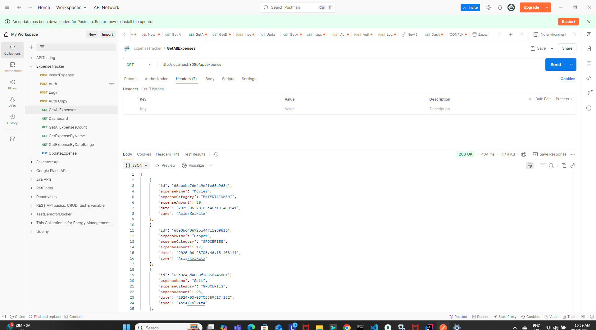

<h1 align="center"> Simple Springboot application - Expense tracker - MongoDB Database  </h1>  

  <b>Description:</b> This is a simple Springboot application which creates apis for the expenses. the apis will have the below functionalities:
 <li>get all expenses</li>
 <li>get all expenses by Category</li>
 <li>update expense</li>
 <li>insert new expense</li>

## Table of Contents

- [Introduction](#introduction)
- [Features](#features)
- [Requirements](#requirements)
- [Quick Start](#quick-start)

## Introduction
This is a Spring boot application to create, update and list the expenses in the expense tracker

## Pre-requisite:
* Please install MongoDB compass in local machine.
  https://www.mongodb.com/docs/manual/tutorial/install-mongodb-on-windows/

After installation you should be able to connect to the Local Mongo DB connection:
by default the port that mongodb connection has 27017

once connected you will be able to see the databases in the left hand side:

### Local
* [Java 11 SDK](https://www.oracle.com/au/java/technologies/javase/jdk11-archive-downloads.html)
* [Maven](https://maven.apache.org/download.cgi)
* [ChromeDriver](https://chromedriver.chromium.org/downloads)

## Execution modes ## 🤖 Starting up

Start with Spring Starter https://start.spring.io/
and add dependencies:
-spring-boot-starter-data-mongodb
-spring-boot-starter-web
-lombok
-spring-boot-starter-test
-junit-jupiter
-mongodb

## Working Tests

# Get all expenses ( without Authentication token)

# Get expenses count ( with Authentication token)

# Get expenses filter by date ( with Authentication token )

